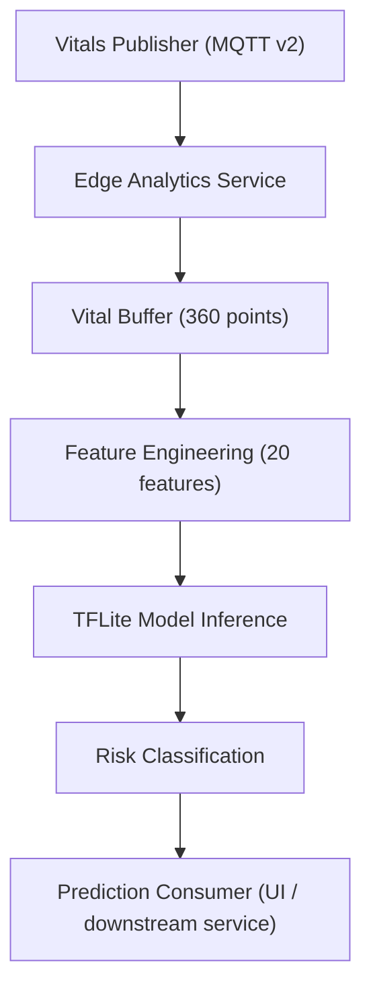

# MedTech Edge Analytics

Edge inference service for sepsis risk scoring using TensorFlow Lite and MQTT.

## Clinical Disclaimer

This repository is for development and evaluation workflows. It is not a certified medical device and must not be used as a standalone basis for clinical decisions.

## Current Project State

- Stable edge inference pipeline with MQTT ingest and MQTT prediction publishing
- Strict v2 telemetry schema enforcement (`version == "2.0"`)
- 20-feature model input vector with respiratory and lactate-based clinical signals
- Local quality gates for formatting, linting, typing, and tests
- Containerized runtime supported via Docker

## System Architecture



## Repository Layout

- `src/inference/`: model wrapper, feature extraction, sepsis scoring
- `src/mqtt/`: payload validation/serialization and MQTT client
- `src/utils/`: configuration and logging helpers
- `tests/`: unit and integration tests
- `models/`: TFLite artifacts and model documentation
- `tools/`: local developer and CI utility scripts

## Prerequisites

- Python 3.10+
- pip
- Optional: Docker (for containerized execution)
- Optional: local MQTT broker (for live topic integration)

## Installation

```bash
python -m venv .venv
source .venv/bin/activate
pip install -r requirements-dev.txt
```

## Running the Service

### Scenario mode (no broker required)

```bash
python -m src --scenario healthy
python -m src --scenario sepsis
python -m src --scenario critical
```

### MQTT mode (broker-backed)

```bash
python -m src --mqtt-broker localhost --mqtt-port 1883
```

### Use QEMU-compatible model artifact

```bash
MODEL_PATH=models/sepsis_model_qemu.tflite python -m src --scenario healthy
```

### Regenerate QEMU artifact

```bash
python tools/convert_model_for_qemu.py \
    --input /path/to/source_model \
    --output models/sepsis_model_qemu.tflite \
    --mode float
```

## Configuration

Environment variables are defined in `src/utils/config.py`.

| Variable | Default | Purpose |
|---|---|---|
| `MQTT_BROKER` | `localhost` | MQTT broker hostname/IP |
| `MQTT_PORT` | `1883` | MQTT broker port |
| `MQTT_TOPIC_VITALS` | `medtech/vitals/latest` | Input telemetry topic |
| `MQTT_TOPIC_PREDICTIONS` | `medtech/predictions/sepsis` | Output prediction topic |
| `MODEL_PATH` | `models/sepsis_model.tflite` | Active TFLite artifact |
| `BUFFER_SIZE` | `360` | Number of buffered vital samples |
| `VITAL_INTERVAL_S` | `10` | Synthetic scenario publish interval |
| `LOGLEVEL` | `INFO` | Logging level |

## Telemetry Contract (v2)

The service validates v2 payloads and accepts schema version via `version` or compatibility aliases (`schema_version`, `payload_version`, `contract_version`).
If version is omitted but all required v2 fields are present, the message is treated as v2 and normalized to `"2.0"`.
Mismatched versions are logged and dropped safely.

### MQTT topics

| Direction | Topic |
|---|---|
| Subscribe | `medtech/vitals/latest` |
| Publish | `medtech/predictions/sepsis` |

### Required input fields

`version`, `patient_id`, `timestamp`, `hr`, `bp_sys`, `bp_dia`, `o2_sat`, `temperature`, `respiratory_rate`, `wbc`, `lactate`, `sirs_score`, `qsofa_score`, `quality`, `source`

### Input validation ranges

- `hr`: 30 to 180
- `bp_sys`: 60 to 200
- `bp_dia`: 30 to 130
- `o2_sat`: 50 to 100
- `temperature`: 32 to 42
- `respiratory_rate`: 5 to 60
- `wbc`: 0.5 to 100
- `lactate`: 0.1 to 30
- `sirs_score`: 0 to 4
- `qsofa_score`: 0 to 3

### Prediction payload fields

- `risk_score` (0 to 100)
- `risk_level` (`LOW`, `MODERATE`, `HIGH`)
- `confidence` (0 to 1)
- `timestamp_ms`
- `features_used` (always `20`)
- `model_latency_ms`
- `patient_id`
- `vitals_version`
- `vitals_timestamp`

## Feature Engineering

The model input is a `(1, 20)` float32 vector:

- 0 to 4: heart rate mean/std/min/max/trend
- 5 to 9: systolic BP mean/std/min/max/trend
- 10 to 14: diastolic BP mean/std/min/max/trend
- 15: oxygen saturation mean
- 16: respiratory rate mean
- 17: respiratory rate trend
- 18: lactate mean
- 19: SIRS mean + qSOFA mean composite

Temperature and extended oxygen statistics are retained for monitoring statistics but excluded from the 20-feature model vector.

## Quality and CI Workflow

Run all quality gates locally:

```bash
tools/check_ci.sh
```

Behavior of `tools/check_ci.sh`:

- Default mode applies safe auto-fixes (Black + isort) before checks
- Runs Black, isort, Flake8, MyPy, and Pytest gates
- Returns non-zero exit code if any gate still fails

Optional modes:

```bash
tools/check_ci.sh --check-only
tools/check_ci.sh --fix
```

## Test Commands

```bash
pytest tests/ -v --cov=src
```

## Docker

```bash
docker build -t medtech-edge-analytics .
docker run --rm medtech-edge-analytics
```

## Model Documentation

Detailed model-card and artifact guidance is available in `models/README.md`.

## Planned Enhancements

- Explainability outputs for clinician review
- Validation with real-world cohorts and external datasets
- Retraining and model version governance pipeline
- Ensemble and temporal modeling exploration