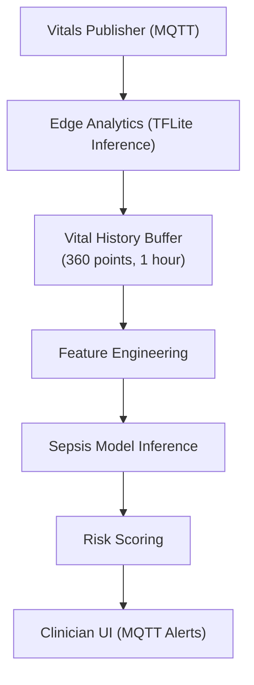

# MedTech Edge Analytics

**Real-time sepsis detection using TensorFlow Lite on-device inference.**

## Overview

This repository implements edge AI for clinical decision support. The system:
- Consumes vital signs via MQTT (from `medtech-vitals-publisher`)
- Maintains a rolling 1-hour history buffer (360 points at 10s intervals)
- Runs TensorFlow Lite sepsis detection model (<100ms latency)
- Publishes predictions back to MQTT (consumed by `medtech-clinician-ui`)
- Operates entirely on-device (no cloud dependency, HIPAA-friendly)

## Architecture




## Quick Start

### Setup Dev Container
```bash
# In VS Code: Cmd+Shift+P → Dev Containers: Reopen in Container
pip install -r requirements-dev.txt
```

### Run Tests

```
pytest tests/ -v --cov=src
```

### Run Inference

```
python -m src --scenario healthy
```

### Run With QEMU Model Artifact

```
MODEL_PATH=models/sepsis_model_qemu.tflite python -m src --scenario healthy
```

To regenerate the QEMU artifact from an original SavedModel/Keras model, use:

```
python tools/convert_model_for_qemu.py --input /path/to/source_model --output models/sepsis_model_qemu.tflite --mode float
```

## Stage 1 Goals
- ✅ TensorFlow Lite model loading & inference
- ✅ Vital history buffer management
- ✅ Sepsis risk scoring
- ✅ MQTT integration
- ✅ Unit tests (>80% coverage)
- ✅ Logging & configuration

## Stage 2+ Roadmap

- Explainability (SHAP)
- Real patient data validation
- Model retraining pipeline
- Ensemble models
- Advanced feature engineering

## Dependencies

- Python 3.11
- TensorFlow Lite Runtime
- NumPy
- Paho MQTT
- Pytest (testing)
- Black (formatting)