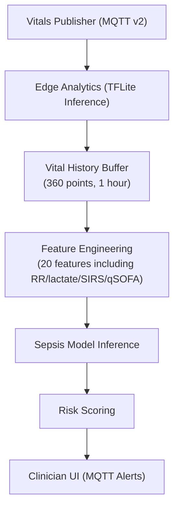

# MedTech Edge Analytics

**Real-time sepsis detection using TensorFlow Lite on-device inference.**

## Overview

This repository implements edge AI for clinical decision support. The system:
- Consumes vital signs via MQTT (from `medtech-vitals-publisher`) — **v2 payload only**
- Maintains a rolling 1-hour history buffer (360 points at 10s intervals)
- Runs TensorFlow Lite sepsis detection model (<100ms latency)
- Publishes predictions back to MQTT (consumed by `medtech-clinician-ui`)
- Operates entirely on-device (no cloud dependency, HIPAA-friendly)

## Telemetry Contract — v2 Payload

> **Strict enforcement**: this service only processes messages with `version == "2.0"`.
> Messages with a missing or mismatched `version` field are **logged as errors and
> dropped** (the service does not crash).

### MQTT Topics

| Direction | Topic | Description |
|-----------|-------|-------------|
| **Subscribe** | `medtech/vitals/latest` | Incoming v2 vital signs |
| **Publish** | `medtech/predictions/sepsis` | Sepsis risk predictions |

### v2 Vital Signs Payload Fields

| Field | Type | Required | Description |
|-------|------|----------|-------------|
| `version` | string | ✅ | Must be `"2.0"` — enforced, all other values rejected |
| `patient_id` | string | ✅ | Unique patient identifier (for traceability) |
| `scenario` | string | — | Scenario name (e.g. `healthy`, `sepsis`) |
| `scenario_stage` | string | — | Stage within the scenario |
| `timestamp` | integer | ✅ | Unix epoch milliseconds |
| `hr` | float | ✅ | Heart rate (bpm) — range [30, 180] |
| `bp_sys` | float | ✅ | Systolic blood pressure (mmHg) — range [60, 200] |
| `bp_dia` | float | ✅ | Diastolic blood pressure (mmHg) — range [30, 130] |
| `o2_sat` | float | ✅ | Oxygen saturation (%) — range [50, 100] |
| `temperature` | float | ✅ | Body temperature (°C) — range [32, 42] |
| `respiratory_rate` | float | ✅ | Respiratory rate (breaths/min) — range [5, 60] |
| `wbc` | float | ✅ | White blood cell count (×10³/µL) — range [0.5, 100] |
| `lactate` | float | ✅ | Lactate level (mmol/L) — range [0.1, 30] |
| `sirs_score` | float | ✅ | SIRS criteria score — range [0, 4] |
| `qsofa_score` | float | ✅ | qSOFA score — range [0, 3] |
| `sepsis_stage` | string | — | Sepsis stage (e.g. `none`, `sepsis`, `septic_shock`) |
| `sepsis_onset_ts` | integer\|null | — | Epoch ms of sepsis onset; `null` if not yet determined |
| `quality` | integer | ✅ | Signal quality percentage |
| `source` | string | ✅ | Data source identifier |

### Prediction Payload Fields

The prediction published to `medtech/predictions/sepsis` includes the following
traceability fields in addition to the core risk assessment:

| Field | Description |
|-------|-------------|
| `risk_score` | Sepsis risk percentage (0–100) |
| `risk_level` | `LOW` / `MODERATE` / `HIGH` |
| `confidence` | Raw model output (0–1) |
| `timestamp_ms` | Prediction creation time (epoch ms) |
| `features_used` | Number of features supplied to the model (always 20) |
| `model_latency_ms` | TFLite inference latency |
| `patient_id` | Forwarded from the v2 vital payload |
| `vitals_version` | Schema version from the vital payload (`"2.0"`) |
| `vitals_timestamp` | Timestamp of the vital reading that triggered this prediction |

## Feature Engineering

The 20-feature input vector for the TFLite model is:

| Index | Feature | Description |
|-------|---------|-------------|
| 0–4 | `hr_*` | Heart rate — mean, std, min, max, trend |
| 5–9 | `bp_sys_*` | Systolic BP — mean, std, min, max, trend |
| 10–14 | `bp_dia_*` | Diastolic BP — mean, std, min, max, trend |
| 15 | `o2_mean` | Mean O₂ saturation |
| 16 | `rr_mean` | Mean respiratory rate (v2 clinical field) |
| 17 | `rr_trend` | Respiratory rate trend/dynamics (v2 clinical field) |
| 18 | `lactate_mean` | Mean lactate level (v2 clinical field) |
| 19 | `sirs_qsofa` | Mean SIRS score + mean qSOFA score composite (v2 clinical field) |

> Temperature is available via `VitalBuffer.get_stats()` for monitoring/alerting
> but is intentionally excluded from the model input vector.

## Architecture




## Quick Start

### Setup Dev Container
```bash
# In VS Code: Cmd+Shift+P → Dev Containers: Reopen in Container
pip install -r requirements-dev.txt
```

### Run Tests

```
pytest tests/ -v --cov=src
```

### Run Inference

```
python -m src --scenario healthy
```

### Run With QEMU Model Artifact

```
MODEL_PATH=models/sepsis_model_qemu.tflite python -m src --scenario healthy
```

To regenerate the QEMU artifact from an original SavedModel/Keras model, use:

```
python tools/convert_model_for_qemu.py --input /path/to/source_model --output models/sepsis_model_qemu.tflite --mode float
```

## Stage 1 Goals
- ✅ TensorFlow Lite model loading & inference
- ✅ Vital history buffer management
- ✅ Sepsis risk scoring
- ✅ MQTT integration
- ✅ Unit tests (>80% coverage)
- ✅ Logging & configuration

## Stage 2 (v2 Payload)
- ✅ v2 MQTT payload schema enforcement (`version == "2.0"`)
- ✅ New clinical fields: respiratory rate, WBC, lactate, SIRS, qSOFA
- ✅ Feature engineering updated with RR dynamics + lactate + SIRS/qSOFA
- ✅ Prediction payload enriched with patient_id / vitals_version traceability

## Stage 3+ Roadmap

- Explainability (SHAP)
- Real patient data validation
- Model retraining pipeline
- Ensemble models
- Advanced feature engineering

## Dependencies

- Python 3.11
- TensorFlow Lite Runtime
- NumPy
- Paho MQTT
- Pytest (testing)
- Black (formatting)